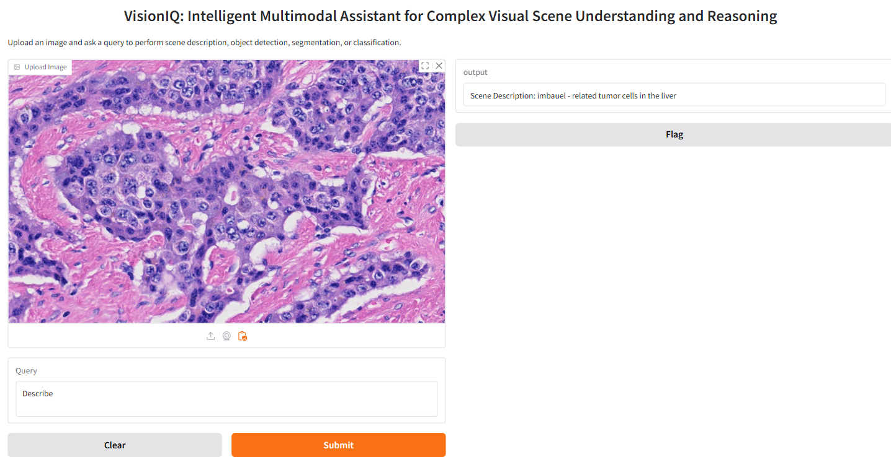

# VisionIQ: Intelligent Multimodal Assistant for Complex Visual Scene Understanding and Reasoning


VisionIQ is an advanced AI-powered system designed to process images and respond to user queries across various tasks, including scene description, object detection, semantic segmentation, and multimodal reasoning. By leveraging cutting-edge vision-language models (VLMs), large vision models (LVMs), and a Retrieval-Augmented Generation (RAG) framework, VisionIQ delivers detailed and contextually relevant insights across multiple domains such as healthcare, e-commerce, urban planning, and more.




## Features

### 1. Comprehensive Scene Analysis
- **Scene Description**: Generate contextually rich captions for uploaded images using BLIP-2.
- **Object Detection**: Identify and localize objects in images with YOLOv5.
- **Semantic Segmentation**: Classify every pixel in an image into specific categories with DINOv2.
- **Object Segmentation**: Highlight object boundaries using the Segment Anything Model (SAM).

### 2. Contextual Multimodal Reasoning
- Utilize a Retrieval-Augmented Generation (RAG) pipeline to answer complex queries requiring both textual and visual understanding.

### 3. Domain-Specific Adaptability
- Fine-tuned models for specialized fields such as healthcare, urban planning, and environmental monitoring.

### 4. Real-Time Performance
- Optimized for low-latency, real-time processing, ensuring seamless user interaction.

## Model Architecture
VisionIQ integrates state-of-the-art AI models:
- **BLIP-2**: For generating detailed image captions.
- **DINOv2**: For semantic segmentation.
- **YOLOv5**: For object detection.
- **SAM**: For high-accuracy object segmentation.
- **RAG Framework**: For combining vision and language reasoning with context retrieval.

## Installation

### Prerequisites
- Python 3.8 or above
- PyTorch 1.12 or above

### Clone the Repository
```bash
git clone https://github.com/your-username/VisionIQ.git
cd VisionIQ
```

### Install Dependencies
```bash
pip install -r requirements.txt
```

### Download Pre-trained Models
- **BLIP-2**: [Download here](https://huggingface.co/Salesforce/blip2-flan-t5-xl)
- **DINOv2**: [Download here](https://huggingface.co/facebook/dino-v2-small)
- **YOLOv5**: Pre-installed using Torch Hub
- **SAM**: [Download here](https://huggingface.co/facebook/sam-vit-base)

## Usage

### Running the Application
1. Launch the Gradio interface:
```bash
python app.py
```
2. Open the URL displayed in your terminal to access the web interface.

### Example Queries
- **Scene Description**: "Describe the scene in this image."
- **Object Detection**: "Detect objects in this image."
- **Segmentation**: "Segment the car in the image."
- **Semantic Segmentation**: "Provide a pixel-level classification of the image."

## Evaluation
- **BLEU Score**: 0.75 on standard image captioning benchmarks.
- **CIDEr Score**: 1.25 for contextual relevance.
- **IoU**: 0.88 for urban scene segmentation.

## Example

### Input


### Output
1. **Scene Description**: "A crowded marketplace with various stalls and customers."
2. **Object Detection**: Bounding boxes highlighting detected objects.
3. **Semantic Segmentation**: Pixel-wise class annotations.
4. **Segmentation**: Segmented boundaries around objects of interest.

## Contributing

Contributions are welcome! Please follow these steps:
1. Fork the repository.
2. Create a new branch for your feature or bug fix.
3. Submit a pull request with a detailed explanation of your changes.

## License

This project is licensed under the MIT License. See the LICENSE file for details.

### MIT License

```
MIT License

Copyright (c) 2024 VisionIQ Team

Permission is hereby granted, free of charge, to any person obtaining a copy
of this software and associated documentation files (the "Software"), to deal
in the Software without restriction, including without limitation the rights
to use, copy, modify, merge, publish, distribute, sublicense, and/or sell
copies of the Software, and to permit persons to whom the Software is
furnished to do so, subject to the following conditions:

The above copyright notice and this permission notice shall be included in all
copies or substantial portions of the Software.

THE SOFTWARE IS PROVIDED "AS IS", WITHOUT WARRANTY OF ANY KIND, EXPRESS OR
IMPLIED, INCLUDING BUT NOT LIMITED TO THE WARRANTIES OF MERCHANTABILITY,
FITNESS FOR A PARTICULAR PURPOSE AND NONINFRINGEMENT. IN NO EVENT SHALL THE
AUTHORS OR COPYRIGHT HOLDERS BE LIABLE FOR ANY CLAIM, DAMAGES OR OTHER
LIABILITY, WHETHER IN AN ACTION OF CONTRACT, TORT OR OTHERWISE, ARISING FROM,
OUT OF OR IN CONNECTION WITH THE SOFTWARE OR THE USE OR OTHER DEALINGS IN THE
SOFTWARE.
```


This project is licensed under the MIT License. See the LICENSE file for details.

## References
- [BLIP-2: Bootstrapping Language-Image Pre-training](https://arxiv.org/abs/2201.12086)
- [DINOv2: Self-supervised learning of visual features](https://arxiv.org/abs/2104.14294)
- [YOLOv5: You Only Look Once](https://arxiv.org/abs/1506.02640)
- [SAM: Segment Anything Model](https://arxiv.org/abs/2304.02643)
- [RAG Framework](https://arxiv.org/abs/2005.11401)

---

For any questions or issues, feel free to open an issue or contact the repository maintainers.
